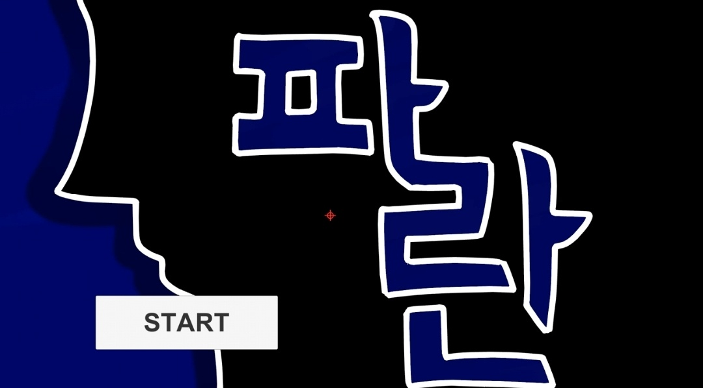

# Pharan
## 개발 참여자
### SoinDosa(기획, 개발, 디자인)

## 개발 환경
### Language : C#
### Graphic : SaiTool
### IDE : Unity 5.6.1

## 어떤 게임인가?
2017년 당시 컴퓨터공학과 학술동아리 EC에서 개최된 신입생 개발대회(EC)Advance)에 참석하여 개발한 게임으로, 가장 처음 유니티개발을 접하게 해준 프로젝트 입니다. 
초기에는 마우스로 에임을 조절하는 2D 횡스크롤 슈팅게임을 기획했으나 유니티 공부에 대부분을 할당한 결과 슈팅기능을 구현할 수 없었습니다. 
결과적으로 결국 초기의 기획서의 조건을 모두 충족하지 못했고 구현된 2D캐릭터와 애니메이션, 점프기능만을 가지고 점프게임으로 구현할 수 밖에 없었습니다. 
점프게임으로 기획이 변경되었고 발표 이후에 추가 개발을 하고 싶었으나 군입대 날짜가 정해지고 나서는 그저 노는 대에만 급급하였고 결국 제 기억에만 남는 프로젝트로만 남게 되었습니다. 
추후 기회가 된다면 당시 기획된 내용대로 개발하고 싶습니다.

## 게임 스냅샷
 

## 게임 소개 영상
<a href="https://youtu.be/tNADiq2DHBA">Youtube Link</a>
